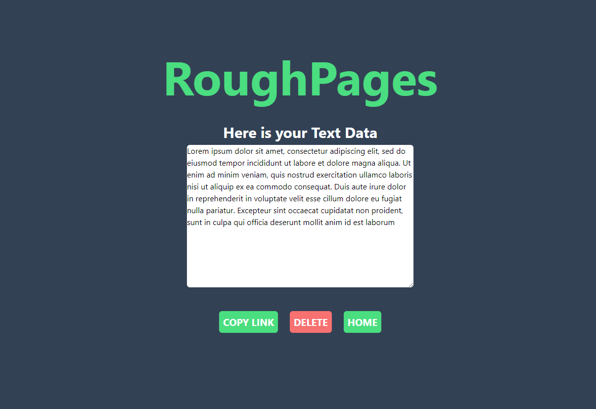

# RoughPages
 Web app made with EJS , MongoDB and tailwindCSS that allows you to paste and share text quickly

 

# About
  RoughPages is a Text Sharing WebApp that allows you to input text data and get a shareable link to access that
  text data from anywhere.

# Installation
  - Run The Following Command to install dependencies
  ```sh
  npm install
  ```
  - To Run the application
  ```sh
  npm start

  ```
